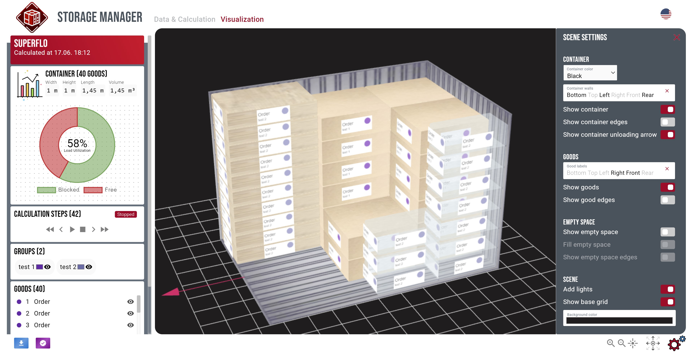

# Storage Manager 2.0

**Live-Demo available on Github Pages: [V0.0.1](https://sebleich.github.io/storage-manager-2.0)**

**[Latest version](https://sebleich.de)**

## Overview

Efficient loading is a significant challenge in logistics. 
The Storage Manager application aims to assist users in finding optimal solutions. 
Originally developed for a competition at TU Dresden, the application is built with TypeScript (Angular 17), employing three.js and Chart.js. 
Presently, three algorithms are provided:

### All In One Row

This algorithm arranges all orders in a single row, commencing from the bottom left corner of the container.

### Start Left Bottom

Supporting stacking, this algorithm places orders adjacent to each other.

### Super Flo

Utilizing temporarily unused spaces, this algorithm optimizes order placement.

## Future Enhancements

Future iterations will focus on enhancing the algorithms. For example, addressing issues such as the invalid solutions generated by the Start Left Bottom algorithm and integrating group restrictions into the Super Flo algorithm. Additionally, all algorithms will be upgraded to support animation features; presently, only the Super Flo algorithm includes animated calculation steps.

Furthermore, the upcoming update will introduce a custom API feature, enabling connection to self-created solvers via a RESTful interface.
