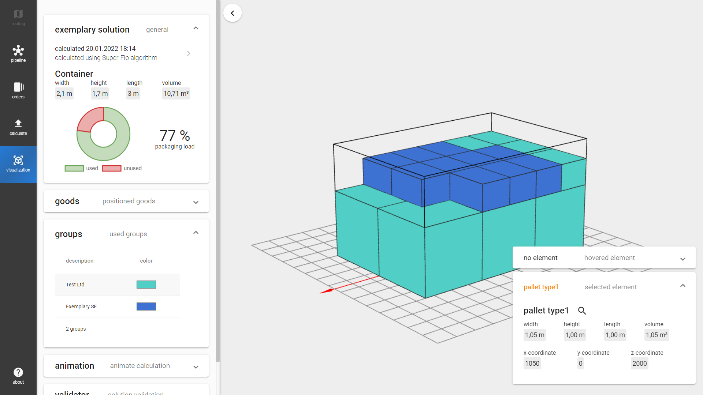

# Storage Manager 2.0

Live-Demo available on Github Pages: <https://sebleich.github.io/storage-manager-2.0>

## General

Loading optimization is a difficult problem in logistics.
Thus, the storage manager application is supposed to support users finding optimal solutions.
The application is based on a former solution designed for an competition at the TU Dresden, written with TypeScript (Angular 14) and implemented using three.js and Chart.js.
Currently, there are three algorithms provided.

### All In One Row

The algorithm places all provided orders in one row starting at the left bottom corner of the container.

### Start Left Bottom

The algorihm supports stacking and placing orders next to each other.

### Super Flo

The algorithm uses temporary stored unused spaces to place orders.

## Future plans

In future, the algorithms need to be improved.
For instance, the Start Left Bottom algorithm produces invalid solutions.
Furthermore, the group restriction is ignored in the Super Flo algorithm yet.
In addition, all algorithms should support the animation feature.
Currently, only the Super Flo algorithm enables to animate the calculation steps.

Next, the custom API feature for connecting self created solvers via a RESTful interface will be introduced.
